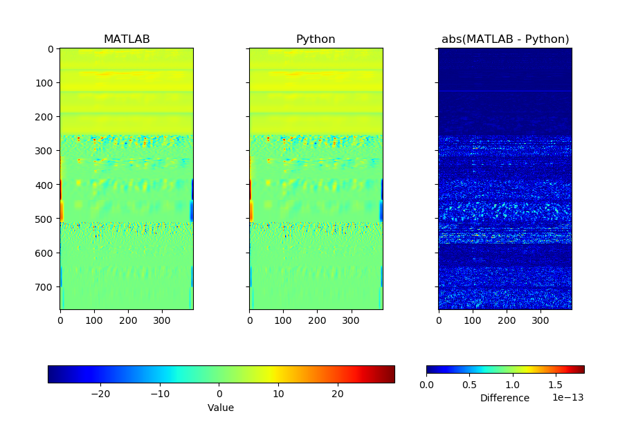

# MRCG_python

Fork of [original port](https://github.com/MoongMoong/MRCG_python) from MATLAB by Jaeseok Kim.
* Added unit tests to check against reference MATLAB implementation
* Restructured to make importable as submodule
* Fixed slight issue, now matches MATLAB results very accurately
* Added some dotfiles (e.g. gitignore), license, and requirements.txt
* Now requires Python 3.6+

## Comparison vs MATLAB
This figure shows the results match the MATLAB implementation to better than `2e-13`, a practical upper limit of floating point rounding etc errors

## Original Readme:

MRCG : Multi-resolution cochleagram
This code extracts MRCG features from speech signal

I had rewriten reference code in python language.
reference code : http://web.cse.ohio-state.edu/pnl/shareware/chenj-taslp14/

I modified some functions for reduce computation cost.

Regards,
Jaeseok, Kim
